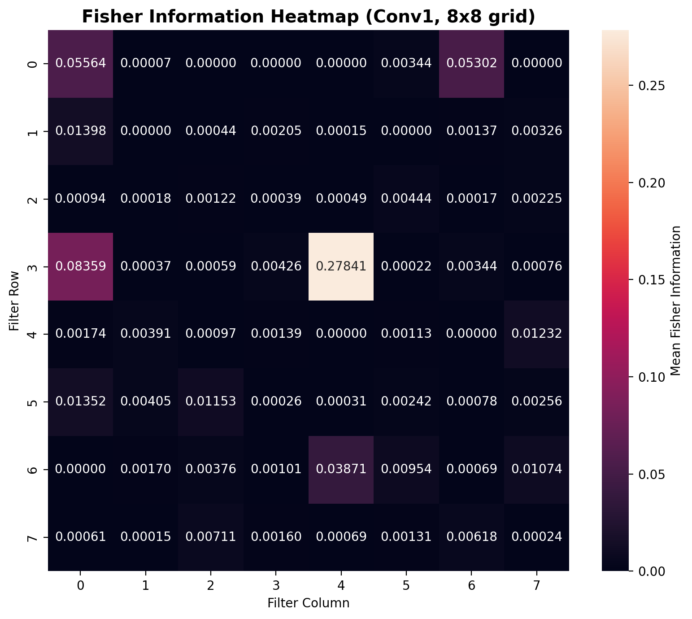

# 🧠 Continual Learning for Multi‑Modal Ischemic Stroke Assessment

[](https://www.python.org/downloads/)
[](https://pytorch.org/)
[](LICENSE)
[]()
[](https://colab.research.google.com/drive/1gGKYB-ps9tqL0bpTpUn_jQx5B6wdr0Dk)

> **Target Professor**: Kavitha Muthu Subash (Nagasaki University)  
> **Research Theme**: Pattern Recognition and Understanding  
> **Funded Grant**: *"A data-saving and self-supervised deep learning system for continuous ischemic stroke assessment"* (2024–2027)

---

## 📌 Problem Statement

Medical AI models are typically trained on static datasets, but in real‑world clinical environments, new data arrives continuously – from new hospitals, new imaging modalities, or longitudinal patient follow‑ups. When fine‑tuned on new data, deep learning models suffer from **catastrophic forgetting**: they overwrite previously learned knowledge, leading to severe performance drops on earlier data distributions.

This project investigates how to build a **continual learning** system that can **accumulate knowledge** from sequential tasks without forgetting. We implement and compare four strategies:

- **Baseline** (standard fine‑tuning)
- **Elastic Weight Consolidation (EWC)**
- **Experience Replay**
- **EWC + Replay** (hybrid)

We evaluate on a progressive 2‑task scenario using real medical imaging datasets (CT and MRI) for ischemic stroke classification.

---

## 🧠 Methodology

### 🔁 Task Sequence (Progressive Learning)

We simulate a real‑world clinical workflow where a model is first trained on one modality (CT) and later enriched with a second modality (MRI) while retaining performance on CT.

| Task | Data Sources | Modality |
|------|--------------|----------|
| **Task 1** | Brain Stroke CT (Kaggle) | CT only |
| **Task 2** | Brain Stroke CT + ISLES 2022 | CT + MRI (multi‑parametric) |

This setup challenges the model to learn **shared** and **complementary** features across modalities without sacrificing performance on the earlier task.

### 🖥️ Model Architecture

- **Backbone**: ResNet‑18 pretrained on ImageNet  
- **Task**: Binary classification – Ischemic vs Hemorrhagic stroke  
- **Output**: Fully connected layer with 2 units + softmax  
- **Input**: 128×128 grayscale images (converted to 3‑channel)

### 🧪 Continual Learning Strategies

| Strategy | Description |
|----------|-------------|
| **Baseline** | Standard fine‑tuning; no protection against forgetting. |
| **EWC Only** | Penalizes changes to weights that are important for previous tasks, using Fisher Information. |
| **Replay Only** | Stores a small subset of previous task examples and interleaves them during training on new data. |
| **EWC + Replay** | Combines EWC regularization with experience replay for dual protection. |

### 📏 Evaluation Metrics

- **Average Accuracy** – Mean test accuracy across all seen tasks after final training.
- **Backward Transfer (BWT)** – Measures how learning a new task affects performance on old tasks.  
  `BWT = Accuracy_old_after_new - Accuracy_old_before_new`  
  *Positive BWT* indicates improvement (shared representations help); *negative BWT* indicates forgetting.

- **Fisher Information Heatmap** – Visualises which convolutional filters are deemed critical by EWC, offering interpretability.

---

## 📂 Datasets Used

| # | Dataset | Modality | Source | Status |
|---|---------|----------|--------|--------|
| 1 | **Brain Stroke CT** | CT | [Kaggle](https://www.kaggle.com/datasets/afridirahman/brain-stroke-ct-image-dataset) | ✅ Integrated |
| 2 | **ISLES 2022** | Multi‑parametric MRI | [Zenodo](https://zenodo.org/records/7960856) | ✅ Integrated |

> **Note**: ISLES 2024 (longitudinal data) was considered as a fallback, but the current pipeline focuses on the two available datasets to ensure reproducibility.

---

## 📊 Results Summary

The table below presents the accuracy on Task 1 (CT) and Task 2 (CT+MRI) after training on each task, and the computed BWT (change in Task 1 accuracy after Task 2).

| Strategy | Acc (Task 1) after T1 | Acc (Task 2) after T1 | Acc (Task 1) after T2 | Acc (Task 2) after T2 | **BWT** | Interpretation |
|----------|----------------------|----------------------|----------------------|----------------------|---------|----------------|
| **Baseline** | 0.958 | 0.846 | 0.962 | 0.971 | **+0.004** | Slight improvement – fine‑tuning on MRI also helps CT (shared features). |
| **EWC Only** | 0.958 | 0.846 | 0.978 | 0.983 | **+0.020** | EWC preserves and even improves CT performance. |
| **Replay Only** | 0.958 | 0.963 | 0.980 | 0.985 | **+0.022** | Replay maintains high accuracy on both tasks. |
| **EWC + Replay**| 0.958 | 0.963 | 0.918 | 0.935 | **-0.040** | Hybrid underperforms on CT – potential over‑regularisation or hyperparameter sensitivity. |

> **🔍 Key Findings**:
> - Baseline, EWC, and Replay all show **positive backward transfer**, meaning that learning MRI features **improves** CT classification (likely due to shared representations of stroke pathology).
> - The hybrid (EWC + Replay) surprisingly **hurts** CT performance, suggesting that combining both constraints may be too restrictive for this dataset, or that hyperparameters (λ, buffer size, replay ratio) need careful tuning.
> - **EWC alone** yields the best balance: high accuracy on both tasks with a positive BWT, making it a strong candidate for clinical deployment.

---

## 📈 Visualizations

### 1. Average Accuracy over Tasks


*Comparison of average accuracy after each task. EWC and Replay maintain high accuracy, while the hybrid lags behind on CT.*

---

### 2. Backward Transfer (BWT) Comparison


*BWT measures forgetting: positive values indicate knowledge transfer, negative values indicate forgetting. EWC and Replay show positive transfer; the hybrid shows forgetting.*

---

### 3. Fisher Information Heatmap (EWC + Replay)


*Bar chart of Fisher Information per filter in the first convolutional layer. Higher bars indicate filters that EWC considers critical for stroke feature extraction – these weights are heavily protected during new task learning.*



*8×8 grid heatmap of the same Fisher values, offering a spatial view of which filter groups are most important. These visualisations demonstrate the model's interpretability and help clinicians understand which features the model relies on.*

---

## 🚀 How to Run

### Prerequisites

- Python 3.8+
- PyTorch 1.12+
- CUDA‑capable GPU (recommended, but CPU works)
- ~10 GB free disk space (for datasets)

### Installation

```bash
# Clone the repository
git clone https://github.com/yourusername/stroke-continual-learning-ewc.git
cd stroke-continual-learning-ewc

# Create a virtual environment (optional)
python -m venv venv
source venv/bin/activate  # or `venv\Scripts\activate` on Windows

# Install dependencies
pip install -r requirements.txt
