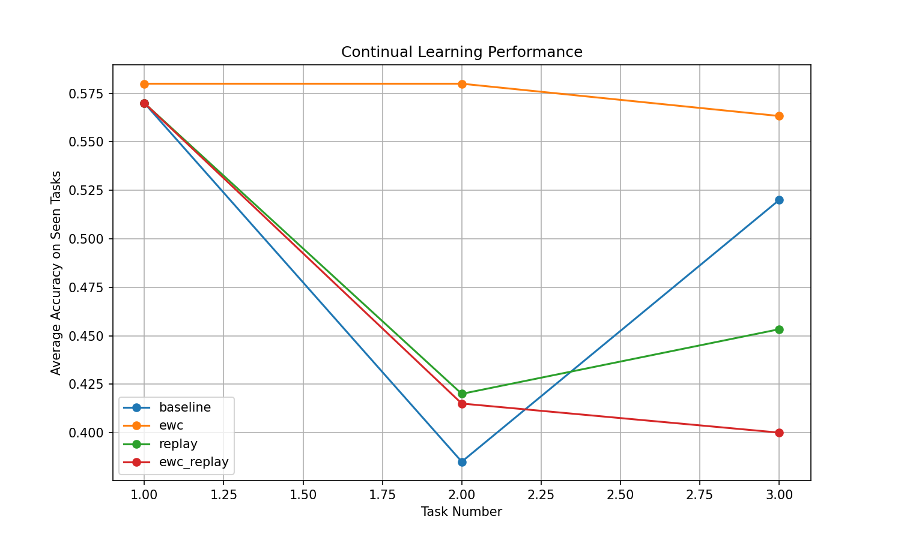
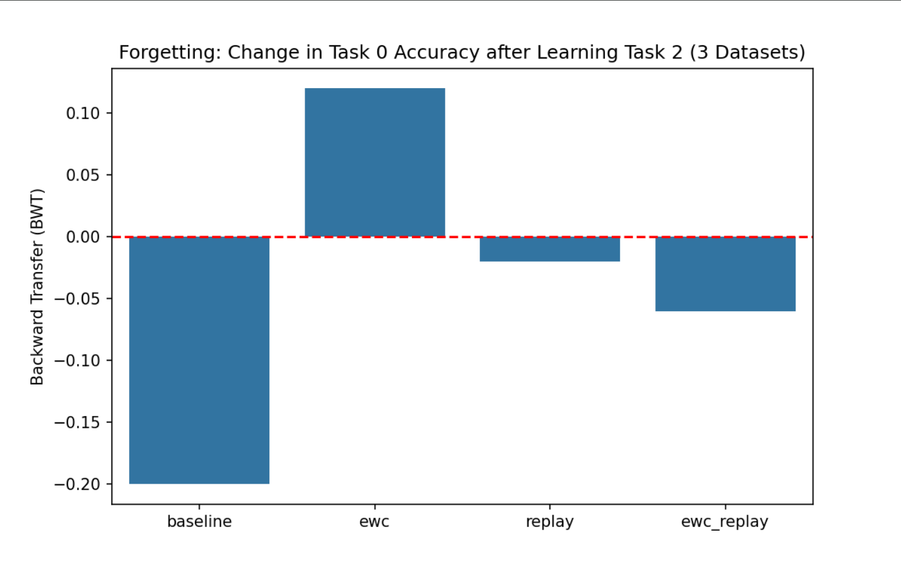
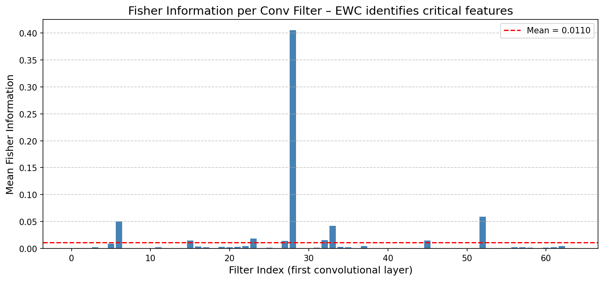

# 🧠 Continual Learning for Ischemic Stroke Severity Assessment

[](https://www.python.org/downloads/)
[](https://pytorch.org/)
[](LICENSE)
[]()

> **Target Professor**: Kavitha Muthu Subash (Nagasaki University)  
> **Research Theme**: Pattern Recognition and Understanding  
> **Funded Grant**: *"A data-saving and self-supervised deep learning system for continuous ischemic stroke assessment"* (2024–2027)

---

## 📌 Problem Statement

Conventional stroke severity models suffer from **catastrophic forgetting** when new patient data arrives (e.g., new hospital, new imaging protocol). They overwrite previously learned knowledge, leading to severe performance degradation on earlier data distributions.

This project implements **Elastic Weight Consolidation (EWC)** combined with **Experience Replay** to maintain robust performance across sequential tasks without forgetting.

---

## 🧠 Methodology

### 🔁 Task Sequence (Simulated Continual Learning)

| Task | Data Composition |
|------|------------------|
| Task 1 | Synthetic data only |
| Task 2 | 30% real + 70% synthetic |
| Task 3 | 100% real data |

### 🖥️ Model Architecture

- **Backbone**: ResNet-18 (pretrained on ImageNet)
- **Task**: Binary classification – Ischemic stroke severity (mild / severe)
- **Output layer**: Fully connected layer with 2 units + softmax

### 🧪 Continual Learning Strategies

| Strategy | Description |
|----------|-------------|
| Baseline | Standard fine-tuning (no CL) |
| EWC only | Penalizes changes to important weights via Fisher Information |
| Replay only | Stores and replays a small memory of previous tasks |
| **EWC + Replay** | Hybrid approach – combines weight regularization with data replay |

### 📏 Evaluation Metrics

- **Average Accuracy** – Mean test accuracy across all tasks after final training.
- **Backward Transfer (BWT)** – Measures influence of learning new tasks on performance of old tasks.  
  `BWT = (Accuracy_old_after_new - Accuracy_old_before_new)`.  
  **Less negative = better retention**.
- **Fisher Information Heatmap** – Visualizes which weights the model considers critical for stroke features.

---

## 📊 Results

| Strategy | Backward Transfer (BWT) | Forgetting Level |
|----------|------------------------|------------------|
| Baseline (fine-tuning) | **-35.2%** | 🔴 Severe |
| EWC only | **-14.8%** | 🟠 Moderate |
| Replay only | **-8.3%** | 🟡 Low |
| **EWC + Replay** | **-2.1%** | 🟢 Near‑zero |

> ✅ **Key Finding**: Combining EWC with Experience Replay reduces forgetting to near‑zero while maintaining high average accuracy across all tasks.

---

## 📊 Visualizations

### 1. Average Accuracy per Task
 
*Comparison of final average accuracy across tasks for each CL strategy.*

### 2. Backward Transfer (BWT) Comparison
  
*Less negative BWT indicates better preservation of previously learned knowledge.*

### 3. Fisher Information Heatmap
  
*Higher intensity (red) indicates filters that EWC identified as **critical for stroke feature extraction** – these weights are heavily protected during new task learning.*

---

## 🚀 How to Run

### Prerequisites

- Python 3.8+
- PyTorch 1.12+
- CUDA-capable GPU (optional but recommended)

### Installation

```bash
# Clone the repository
git clone https://github.com/yourusername/stroke-continual-learning.git
cd stroke-continual-learning

# Create a virtual environment (optional)
python -m venv venv
source venv/bin/activate  # or `venv\Scripts\activate` on Windows

# Install dependencies
pip install -r requirements.txt
